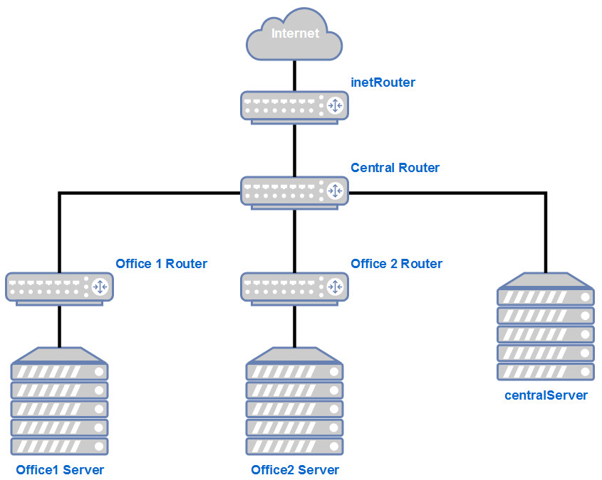
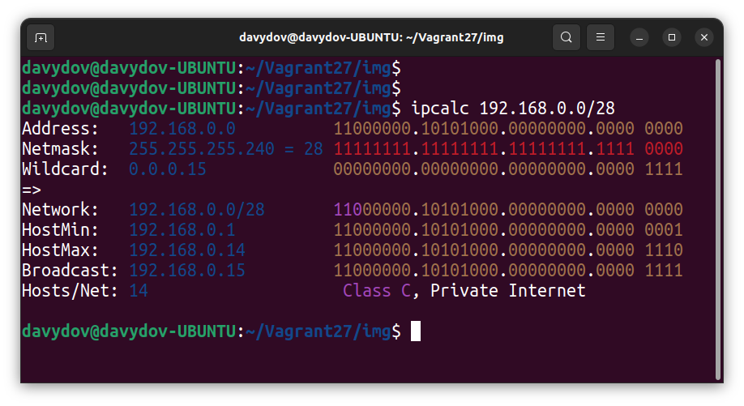
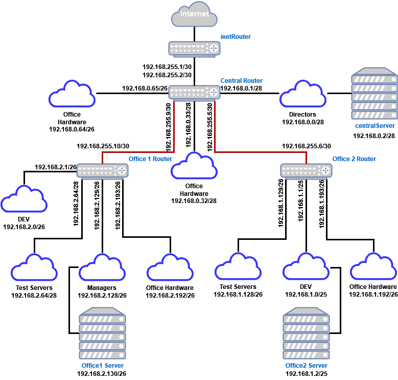
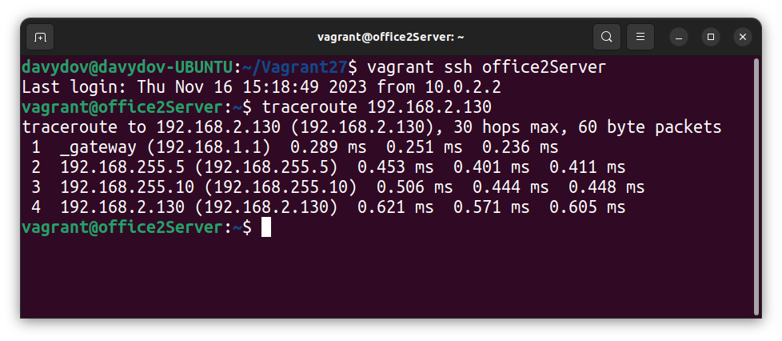
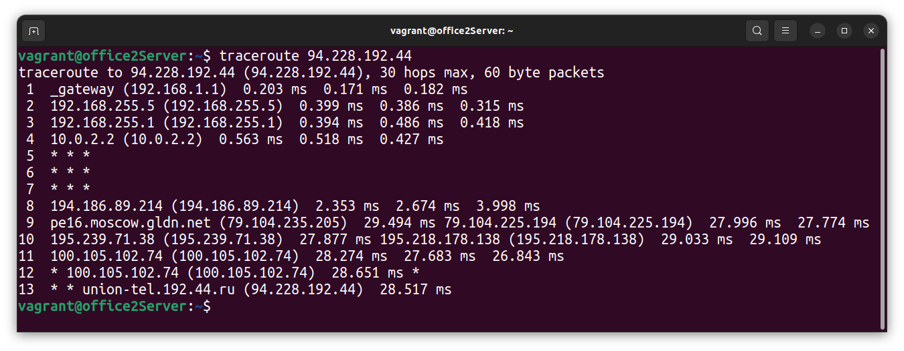

# LESSON 27 - Организация сетевой лаборатории

## Задача:
 - Создать сетевую лабораторию;
 - Научиться менять базовые сетевые настройки в системах на базе Linix.

## Дано:
 1. [Vagrant файл](https://github.com/erlong15/otus-linux/blob/network/Vagrantfile) c начальной организацией сети:
    - inetRouter
    - centralRouter
    - centralServer
 2. Планируемая архитектура, которую необходимо реализовать:
    - Сеть **office1**
        - 192.168.2.0/26 - dev
        - 192.168.2.64/26 - test servers
        - 192.168.2.128/26 - managers
        - 192.168.2.192/26 - office hardware

    - Сеть **office2**
        - 192.168.1.0/25 - dev
        - 192.168.1.128/26 - test servers
        - 192.168.1.192/26 - office hardware

    - Сеть **central**
        - 192.168.0.0/28 - directors
        - 192.168.0.32/28 - office hardware
        - 192.168.0.64/26 - wifi
    
    
    ```
    **Office1 --\**
    - --> Central --IRouter --> Internet
    **Office2 --/**
    ```    

    В результате должны получиться следующие сервера:
    - inetRouter;
    - centralRouter;
    - office1Router;
    - office2Router;
    - centralServer;
    - office1Server;
    - office2Server;

## 1. Теоретическая часть:
1.1 Найти свободные подсети;  
1.2 Посчитать, сколько узлов в каждой подсети, включая   свободные;  
1.3 Указать BROADCAST адрес для каждой подсети;  
1.4 Проверить, нет ли ошибок при разбиени.  

Первым шагом мы рассмотрим все сети, указанные в задании.

Посчитаем для них количество узлов, найдём Broadcast-адрес, проверим, нет ли ошибок при разбиении.

Расчеты можно выполнить вручную, или воспользоваться калькулятором сетей. Для примера, посчитаем одну подсеть вручную:

У нас есть сеть directors 192.168.0.0/28

192.168.0.0 — это сама сеть, 28 — это маска. Маска показывает нам, границы сети 192.168.0.0. Маска может быть записана в 2-х видах:

1) /28  
2) 255.255.255.240

Пример перевода маски /28 в формат 255.255.255.240:

Маска Ipv4-адреса — это 4 октета, т.е. 4 блока по 8 цифр (1 или 0).  

/28 — это 28 единиц с начала маски: **11111111.11111111.11111111.11110000**

Всегда при разбиении сетей, после знака / указывается количество единиц с начала маски.

**11111111.11111111.11111111.11110000** — это двоичный код маски, если мы переведем данное значение в деситеричную систему счисления, то получим 255.255.255.240

Далее посчитаем количество устройств в сети: Количество устройств в сети рассчитывается по формуле = 2^(32−маска) − 2

Таким образом, количество устройств для подсети /28 будет = 2^(32−28) − 2 = 16 − 2 = 14

Цифра 2 вычитается, так как:

- Первый адрес (192.168.0.0) — это наименование подсети, его нельзя задать устройству
- Последний адрес (192.168.0.15) — это всегда broadcast-адрес.

Broadcast-адрес нужен для рассылки всем устройствам сети.

Таким образом мы можем сформировать таблицу топологии нашей сети

| Сеть | Маска | Кол-во адресов | Первый адрес в сети | Последний адрес в сети | Broadcast адрес |
| --- | --- | --- | --- | --- | --- |
| 192.168.0.0/28 | 255.255.255.240 | 14 | 192.168.0.1 | 192.168.0.14 | 192.168.0.15 |

По такому примеру нужно рассчитать остальные сети. Для проверки себя можно использовать калькулятор масок, например <https://ip-calculator.ru/> или ipcacl, который будет испольован в примере.

Для выполнения расчета указываем IP-адрес сети и её маску:  

Результат расчетов всех сетей сведём в таблицу:


| Name | Network | Netmask | H's | HostMin | HostMax | Broadcast |
| ---  | --- | --- | --- | --- | --- | --- |
| Central Network |
| Directors | 192.168.0.0/28 | 255.255.255.240 | 14 | 192.168.0.1 | 192.168.0.14 | 192.168.0.15 |
| Office hardware | 192.168.0.32/28 | 255.255.255.240 | 14 | 192.168.0.33 | 192.168.0.46 | 192.168.0.47 |
| Wifi (mgt network) | 192.168.0.64/26 | 255.255.255.192 | 62 | 192.168.0.65 | 192.168.0.126 | 192.168.0.127 |
| Office 1 network |
| Dev | 192.168.2.0/26 | 255.255.255.192 | 62 | 192.168.2.1 | 192.168.2.62 | 192.168.2.63 |
| Test | 192.168.2.64/26 | 255.255.255.192 | 62 | 192.168.2.65 | 192.168.2.126 | 192.168.2.127 |
| Managers | 192.168.2.128/26 | 255.255.255.192 | 62 | 192.168.2.129 | 192.168.2.190 | 192.168.2.191 |
| Office hardware | 192.168.2.192/26 | 255.255.255.192 | 62 | 192.168.2.193 | 192.168.2.254 | 192.168.2.255 |
| Office 2 network |
| Dev | 192.168.1.0/25 | 255.255.255.128 | 126 | 192.168.1.1 | 192.168.1.126 | 192.168.1.127 |
| Test | 192.168.1.128/26 | 255.255.255.192 | 62 | 192.168.1.129 | 192.168.1.190 | 192.168.1.191 |
| Ofiice | 192.168.1.192/26 | 255.255.255.192 | 62 | 192.168.1.193 | 192.168.1.254 | 192.168.1.255 |
| InetRouter - CentralRouter network |
| Inet - central ## 1. Теоретическая часть:
1.1 Найти свободные подсети;  | 192.168.255.0/30 | 255.255.255.252 | 2 | 192.168.255.1 | 192.168.255.2 | 192.168.255.3 |

Широковещательный адрес будет являться последним в текущей сети, следовательно, следующий за ним будет представлять следующую подсеть. На основании анализа данной информации можем найти промежутки между ними. Указанные в задании между собой не пересекаются, а значит ошибок в них не допущено, а имеющиеся промежутки являются свободными:

| Network | Netmask | HostMin | HostMax | Broadcast | Hosts/Net |
| --- | --- | --- | --- | --- | --- |
| 192.168.0.16/28 | 255.255.255.240 | 192.168.0.17 | 192.168.0.30 | 192.168.0.31 | 14 |
| 192.168.0.48/28 | 255.255.255.240 | 192.168.0.49 | 192.168.0.62 | 192.168.0.63 | 14 |
| 192.168.0.128/25 | 255.255.255.128 | 192.168.0.129 | 192.168.0.254 | 192.168.0.255 | 126 |
| 192.168.255.64/26 | 255.255.255.192 | 192.168.255.65 | 192.168.255.126 | 192.168.255.127 | 62 |
| 192.168.255.32/27 | 255.255.255.224 | 192.168.255.33 | 192.168.255.62 | 192.168.255.63 | 30 |
| 192.168.255.16/28 | 255.255.255.240 | 192.168.255.17 | 192.168.255.30 | 192.168.255.31 | 14 |
| 192.168.255.8/29 | 255.255.255.248 | 192.168.255.9 | 192.168.255.14 | 192.168.255.15 | 6 |
| 192.168.255.4/30 | 255.255.255.252 | 192.168.255.5 | 192.168.255.6 | 192.168.255.7 | 2 |

## 2. Практическая часть:

Построим полную схему сети:


Рассмотрим схему сети:
- Облака - означают сеть, которую необходимо настроить на сервере;
- Роутеры и сервера - являются хостами, которые нужно создать.

На схеме, мы также можем увидеть, что нам потребуется создать дополниельно 2 сети (на схеме обозначеные красными линииями):
- Для соединения office1Router c centralRouter;
- Для соединения office2Router c centralRouter.

На остновании всего этого, получаем готовый список серверов:

| Server | IP / Bitmask | 
| --- | --- |
| inetRouter: | | 
| 1 | Default-NAT address VirtualBox |
| 2 | 192.168.255.1/30 |
| centralRouter: | |
| 1 | 192.168.255.2/30 | 
| 2 | 192.168.0.1/28 |
| 3 | 192.168.0.33/28 |
| 4 | 192.168.0.65/26 |
| 5 | 192.168.255.9/30 | 
| 6 | 192.168.255.5/30 |
| centralServer: | |
| 1 | 192.168.0.2/28 |
| office1Router: | | 
| 1 | 192.168.255.10/30 |
| 2 | 192.168.2.1/26 |
| 3 | 192.168.2.65/26 |
| 4 | 192.168.2.129/26 | 
| 5 | 192.168.2.193/26 |
| office1Server: | |
| 1 | 192.168.2.130/26 |
| office2Router: | | 
| 1 | 192.168.255.6/30 |
| 2 | 192.168.1.1/26 |
| 3 | 192.168.1.129/26 |
| 4 | 192.168.1.193/26 |
| office2Server: | |
| 1 | 192.168.1.2/26 |

Все виртуальные машины у нас будут работать на Ubuntu 22.04.

```Ruby
MACHINES = {
  :inetRouter => {
        :box_name => "generic/ubuntu2204",
        :vm_name => "inetRouter",
        #:public => {:ip => "10.10.10.1", :adapter => 1},
        :net => [   
                    #ip, adpter, netmask, virtualbox__intnet
                    ["192.168.255.1", 2, "255.255.255.252",  "router-net"], 
                    ["192.168.56.10", 8, "255.255.255.0"],
                ]
  },

  :centralRouter => {
        :box_name => "generic/ubuntu2204",
        :vm_name => "centralRouter",
        :net => [
                   ["192.168.255.2",  2, "255.255.255.252",  "router-net"],
                   ["192.168.0.1",    3, "255.255.255.240",  "dir-net"],
                   ["192.168.0.33",   4, "255.255.255.240",  "hw-net"],
                   ["192.168.0.65",   5, "255.255.255.192",  "mgt-net"],
                   ["192.168.255.9",  6, "255.255.255.252",  "office1-central"],
                   ["192.168.255.5",  7, "255.255.255.252",  "office2-central"],
                   ["192.168.56.11",  8, "255.255.255.0"],
                ]
  },
  
  :centralServer => {
        :box_name => "generic/ubuntu2204",
        :vm_name => "centralServer",
        :net => [
                   ["192.168.0.2",    2, "255.255.255.240",  "dir-net"],
                   ["192.168.56.12",  8, "255.255.255.0"],
                ]
  },

  :office1Router => {
        :box_name => "generic/ubuntu2204",
        :vm_name => "office1Router",
        :net => [
                   ["192.168.255.10",  2,  "255.255.255.252",  "office1-central"],
                   ["192.168.2.1",     3,  "255.255.255.192",  "dev1-net"],
                   ["192.168.2.65",    4,  "255.255.255.192",  "test1-net"],
                   ["192.168.2.129",   5,  "255.255.255.192",  "managers-net"],
                   ["192.168.2.193",   6,  "255.255.255.192",  "office1-net"],
                   ["192.168.56.20",   8,  "255.255.255.0"],
                ]
  },

  :office1Server => {
        :box_name => "generic/ubuntu2204",
        :vm_name => "office1Server",
        :net => [
                   ["192.168.2.130",  2,  "255.255.255.192",  "managers-net"],
                   ["192.168.56.21",  8,  "255.255.255.0"],
                ]
  },

  :office2Router => {
       :box_name => "generic/ubuntu2204",
       :vm_name => "office2Router",
       :net => [
                   ["192.168.255.6",  2,  "255.255.255.252",  "office2-central"],
                   ["192.168.1.1",    3,  "255.255.255.128",  "dev2-net"],
                   ["192.168.1.129",  4,  "255.255.255.192",  "test2-net"],
                   ["192.168.1.193",  5,  "255.255.255.192",  "office2-net"],
                   ["192.168.56.30",  8, "255.255.255.0"],
               ]
  },

  :office2Server => {
       :box_name => "generic/ubuntu2204",
       :vm_name => "office2Server",
       :net => [
                  ["192.168.1.2",    2,  "255.255.255.128",  "dev2-net"],
                  ["192.168.56.31",  8, "255.255.255.0"],
               ]
  }
}

Vagrant.configure("2") do |config|

  MACHINES.each do |boxname, boxconfig|

    config.vm.define boxname do |box|
   
      box.vm.box = boxconfig[:box_name]
      box.vm.host_name = boxconfig[:vm_name]
      
      box.vm.provider "virtualbox" do |v|
        v.memory = 768
        v.cpus = 1
       end

      boxconfig[:net].each do |ipconf|
        box.vm.network("private_network", ip: ipconf[0], adapter: ipconf[1], netmask: ipconf[2], virtualbox__intnet: ipconf[3])
      end

      if boxconfig.key?(:public)
        box.vm.network "public_network", boxconfig[:public]
      end

      box.vm.provision "shell", inline: <<-SHELL
        mkdir -p ~root/.ssh
        cp ~vagrant/.ssh/auth* ~root/.ssh
      SHELL
    end
  end
end
```

В данный Vagrantfile мы добавили 4 новых сервера, также к старым серверам добавили 2 интерфейса для соединения сетей офисов.

Дополнительно в коде вы видите сетевые устройства из подсети 192.168.56.0/24 — они не обязательны и потребуются, если вы планируете настраивать хосты с помощью Ansible.
	
После того, как все 7 серверов у нас развернуты, нам нужно настроить маршрутизацию и NAT таким образом, чтобы доступ в Интернет со всех хостов был через inetRouter и каждый сервер должен быть доступен с любого из 7 хостов

## 2.1 Настройка NAT:
Для того, чтобы на всех серверах работал интернет, на сервере inetRouter должен быть настроен NAT. В нашем Vagrantfile он настраивался с помощью команды:

```
iptables -t nat -A POSTROUTING ! -d 192.168.0.0/16 -o eth0 -j MASQUERADE
```

При настройке NAT таким образом, правило удаляется после перезагрузки сервера. Для того, чтобы правила применялись после перезагрузки, в Ubuntu 22.04 нужно выполнить следующие действия:  
1)Подключиться по SSH к хосту: vagrant ssh inetRouter  
2)Проверить, что отключен другой файервол: systemctl status ufw    
> vagrant@inetRouter:\~$ systemctl status ufw  
ufw.service - Uncomplicated firewall  
     Loaded: loaded (/lib/systemd/system/ufw.service; enabled; vendor preset: enabled)  
     Active: active (exited) since Wed 2023-11-15 15:36:17 UTC; 3h 11min ago  
       Docs: man:ufw(8)  
   Main PID: 550 (code=exited, status=0/  SUCCESS)
        CPU: 706us  
        Warning: some journal files were not opened due to insufficient permissions.  
        vagrant@inetRouter:\~\$

Служка фаервола запущена, её нужно отключить и удалить из автозапуска:   

```
systemctl stop ufw
systemctl disable ufw
```

3) Создадим файл /etc/iptables_rules.ipv4:


> \# Generated by iptables-save v1.8.7 on Sat Oct 14 16:14:36 2023  
*filter  
:INPUT ACCEPT [90:8713]  
:FORWARD ACCEPT [0:0]  
:OUTPUT ACCEPT [54:7429]  
-A INPUT -p icmp -j ACCEPT  
-A INPUT -i lo -j ACCEPT  
-A INPUT -p tcp -m state --state NEW -m tcp --dport 22 -j ACCEPT  
COMMIT  
\# Completed on Sat Oct 14 16:14:36 2023  
\# Generated by iptables-save v1.8.7 on Sat Oct 14 16:14:36 2023  
*nat  
:PREROUTING ACCEPT [1:44]  
:INPUT ACCEPT [1:44]  
:OUTPUT ACCEPT [0:0]  
:POSTROUTING ACCEPT [0:0]  
-A POSTROUTING ! -d 192.168.0.0/16 -o eth0 -j MASQUERADE   
COMMIT  
\# Completed on Sat Oct 14 16:14:36 2023  

 4) Создаём файл, в который добавим скрипт автоматического восстановления правил при перезапуске системы: **/etc/network/if-pre-up.d/iptables**
 
 >#!/bin/sh  
/sbin/iptables-restore < /etc/iptables_rules.ipv4

5) Добавляем права на выполнение файла **/etc/network/if-pre-up.d/iptables**
> sudo chmod +x /etc/network/if-pre-up.d/iptables

6) Перезагружаем сервер.
7) После перезагрузки сервера проверяем правила **iptables: iptables-save**
> vagrant@inetRouter:~$ sudo iptables-save   
/# Generated by iptables-save v1.8.7 on Wed Nov 15 19:06:36 2023  
*filter  
:INPUT ACCEPT [65:6249]  
:FORWARD ACCEPT [0:0]  
:OUTPUT ACCEPT [42:5601]  
-A INPUT -p icmp -j ACCEPT  
-A INPUT -i lo -j ACCEPT  
-A INPUT -p tcp -m state --state NEW -m tcp --dport 22 -j ACCEPT  
COMMIT  
/# Completed on Wed Nov 15 19:06:36 2023  
/# Generated by iptables-save v1.8.7 on Wed Nov 15 19:06:36 2023  
*nat  
:PREROUTING ACCEPT [1:44]  
:INPUT ACCEPT [1:44]  
:OUTPUT ACCEPT [0:0]  
:POSTROUTING ACCEPT [0:0]  
-A POSTROUTING ! -d 192.168.0.0/16 -o eth0 -j MASQUERADE  
COMMIT  
/# Completed on Wed Nov 15 19:06:36 2023  

## 2.2 Настройка NAT через Ansible
Выполним идентичные действия с помощью Ansible, для этого в playbook добавим следующие команды:
```YAML
  - name: Set up NAT on inetRouter
    template: 
      src: "{{ item.src }}"
      dest: "{{ item.dest }}"
      owner: root
      group: root
      mode: "{{ item.mode }}"
    with_items:
      - { src: "iptables_rules.ipv4", dest: "/etc/iptables_rules.ipv4", mode: "0644" }
      - { src: "iptables_restore", dest: "/etc/network/if-pre-up.d/iptables", mode: "0755" }
    when: (ansible_hostname == "inetRouter")
```
Модуль template копирует 2 файла, которые были указаны выше. Для файла **/etc/network/if-pre-up.d/iptables** уже установлен атрибут выполнения файла.

## 2.3 Маршрутизация транзитных пакетов (IP forward)
Важным этапом настройки сетевой лаборатории, является маршрутизация транзитных пакетов. Если объяснить простыми словами — это возможность сервера Linux пропускать трафик через себя к другому серверу. По умолчанию эта функция отключена в Linux. Включить её можно командой:
```bash
echo "net.ipv4.conf.all.forwarding = 1" >> /etc/sysctl.conf
sysctl -p
```
Результат работы команды:
> root@inetRouter:~# sysctl -p  
net.ipv6.conf.all.disable_ipv6 = 1  
net.ipv4.conf.all.forwarding = 1

Посмотреть статус форвардинга можно командой: **sysctl net.ipv4.ip_forward**
Если параметр равен 1, то маршрутизация транзитных пакетов включена, если 0 — отключена.

> root@inetRouter:~# sysctl net.ipv4.ip_forward  
net.ipv4.ip_forward = 1

В нашей схеме необходимо включить данную маршрутизацию на всех роутерах.

## 2.4 Настройка маршрутизации транзитных пакетов с помощью Ansible

В Ansible есть специальный блок для внесений изменений в параметры ядра:
```YAML
  - name: set up forward packages across routers
    sysctl:
      name: net.ipv4.conf.all.forwarding
      value: '1'
      state: present
    when: "'routers' in group_names"
```
В условии указано, что изменения будут применяться только для группы «routers», группа routers создана в hosts-файле:

> [routers]  
inetRouter ansible_host=192.168.56.10 ansible_user=vagrant ansible_ssh_private_key_file=.vagrant/machines/inetRouter/virtualbox/private_key  
centralRouter ansible_host=192.168.56.11 ansible_user=vagrant ansible_ssh_private_key_file=.vagrant/machines/centralRouter/virtualbox/private_key  
office1Router ansible_host=192.168.56.20 ansible_user=vagrant ansible_ssh_private_key_file=.vagrant/machines/office1Router/virtualbox/private_key  
office2Router ansible_host=192.168.56.30 ansible_user=vagrant ansible_ssh_private_key_file=.vagrant/machines/office2Router/virtualbox/private_key 

Файл hosts — это файл инвентаризации, в нем указан список серверов, их адреса, группы и способы доступа на сервер.

## 2.5 Отключение маршрута по умолчанию на интерфейсе eth0

При разворачивании нашего стенда Vagrant создает в каждом сервере свой интерфейс, через который у сервера появляется доступ в интернет. Отключить данный порт нельзя, так как через него Vagrant подключается к серверам. Обычно маршрут по умолчанию прописан как раз на этот интерфейс, данный маршрут нужно отключить:


Для отключения маршрута по умолчанию в файле **/etc/netplan/00-installer-config.yaml** добавляем отключение маршрутов, полученных через DHCP:

```# This is the network config written by 'subiquity'
network:
  ethernets:
    eth0:
      dhcp4: true
      dhcp4-overrides:
          use-routes: false
      dhcp6: false
  version: 2
```

После внесения данных изменений перезапускаем сетевую службу:

**netplan try**

Отключение дефолтного маршрута требуется настроить на всех хостах кроме inetRouter

## 2.6 Отключение маршрута по умолчанию с помощью Ansible
Для выполнения идентичных изменений с помощью Ansible, можно воспользоваться следующим блоком:
```
  - name: disable default route
    template: 
      src: 00-installer-config.yaml
      dest: /etc/netplan/00-installer-config.yaml
      owner: root
      group: root
      mode: 0644
    when: (ansible_hostname != "inetRouter") 
```

## 2.7 Настройка статических маршрутов

Для настройки статических маршрутов используется команда **ip route**. 

Давайте рассмотрим пример настройки статического маршрута на сервере office1Server. Исходя из схемы мы видим, что трафик с данного сервера будет идти через office1Router. Office1Server и office1Router у нас соединены через сеть managers (192.168.2.128/26).

**В статическом маршруте нужно указывать адрес следующего хоста.** Таким образом мы должны указать на сервере office1Server маршрут, в котором доступ к любым IP-адресам у нас будет происходить через адрес 192.168.2.129, который расположен на сетевом интерфейсе office1Router. Команда будет выглядеть так: **ip route add 0.0.0.0/0 via 192.168.2.129**

Посмотреть список всех маршрутов: **ip route**

> vagrant@office1Server:\$ ip route  
default via 10.0.2.2 dev eth0 proto dhcp src 10.0.2.15 metric 100  
10.0.2.0/24 dev eth0 proto kernel scope link src 10.0.2.15 metric 100  
10.0.2.2 dev eth0 proto dhcp scope link src 10.0.2.15 metric 100  
10.0.2.3 dev eth0 proto dhcp scope link src 10.0.2.15 metric 100  
192.168.2.128/26 dev eth1 proto kernel scope link src 192.168.2.130   
192.168.50.0/24 dev eth2 proto kernel scope link src 192.168.56.21  
vagrant@office1Server:\$ 

Удалить маршрут: **ip route del 0.0.0.0/0 via 192.168.2.129**

**Важно помнить, что маршруты, настроенные через команду ip route удаляются после перезагрузки или перезапуске сетевой службы.**

Для того, чтобы маршруты сохранялись после перезагрузки нужно их указывать 
непосредственно в файле конфигурации сетевых интерфейсов:

В современных версиях Ubuntu, для указания маршрута нужно поправить netplan-конфиг. Конфиги netplan хранятся в виде YAML-файлов и обычно лежат в каталоге **/etc/netplan**
В нашем стенде такой файл - **/etc/netplan/50-vagrant.yaml** 

Для добавления маршрута, после раздела addresses нужно добавить блок:
```YAML
routes:
 - to: <сеть назначения>/<маска>
   via: <Next hop address>
```
Пример файла **/etc/netplan/50-vagrant.yaml**

```YAML
---
network:
  version: 2
  renderer: networkd
  ethernets:
    enp0s8:
      addresses:
      - 192.168.2.130/26
      routes:
      - to: 0.0.0.0/0
        via: 192.168.2.129
    enp0s19:
      addresses:
      - 192.168.56.21/24
```

В YAML-файле очень важно следить за правильными отступами, ошибка в один пробел не даст сохранить изменения.

Применение изменений:

> root@office1Server:\~\# netplan try  
Do you want to keep these settings?  
Press ENTER before the timeout to accept the new configuration  
Changes will revert in 120 seconds
Configuration accepted.  
root@office1Server:\~\#

При настройке интерфейсов и маршрутов в любой из ОС можно оставлять комментарии в файле. Перед комментарием должен стоять знак «#»

Настройте самостоятельно все маршруты на серверах. Важно помнить, что помимо маршрутов по умолчанию, вам нужно будет использовать обратные маршруты. 

Давайте разберем пример такого маршрута: допустим мы хотим отправить команду ping с сервера office1Server (192.168.2.130) до сервера centralRouter (192.168.0.1) 
Наш трафик пойдёт следующим образом: **office1Server — office1Router — centralRouter — office1Router — office1Server**

Office1Router знает сеть (192.168.2.128/26), в которой располагается сервер office1Server, а сервер centralRouter, когда получит запрос от адреса 192.168.2.130 не будет понимать, куда отправить ответ. Решением этой проблемы будет добавление обратного маршрута. 

Обратный маршрут указывается также как остальные маршруты. Изучив схему мы видим, что связь между сетями 192.168.2.0/24 и 192.168.0.0/24 осуществляется через сеть 192.168.255.8/30. Также мы видим что сети office1 подключены к centralRouter через порт eth5. На основании этих данных мы можем добавить маршрут в файл /etc/netplan/50-vagrant.yaml

```YAML
	eth5:
        addresses:
        - 192.168.255.9/30
        routes:
        - to: 192.168.2.0/24
          via: 192.168.255.8
```
## 2.8 Настройка маршрутов с помощью Ansible
Для настройки маршрутов с помощью Ansible, нам необходимо подготовить файлы 50-vagrant.yaml с маршрутами для всех серверов. Далее с помощью модуля template мы можем их добавлять:

```YAML
  - name: add default gateway for centralRouter
    template: 
      src: "50-vagrant_{{ansible_hostname}}.yaml"
      dest: /etc/netplan/50-vagrant.yaml
      owner: root
      group: root
      mode: 0644

  - name: restart all hosts
    reboot:
      reboot_timeout: 600
```
Для того, чтобы не писать 7 идентичных модулей, можно сделать один модуль, в котором будут перечисляться все хосты. Для этого у template-файлов должны быть идентичные имена формата **50-vagrant_<имя сервера>.yaml**

Также модуль template позволяет использовать jinja2-шаблоны, с помощью которых файл может генерироваться автоматически, собирая информацию из данных о хосте (Ansible facts) и файлов переменных.

На данном этапе настройка серверов закончена. После настройки серверов рекомендуется перезагрузить все хосты, чтобы проверить, что правила не удаляются после перезагрузки. 

## 2.9 Проверка доступности хостов
Проверим доступность хоста **office1Server** c **office2Server**:

Видим прохождение пакетов через все промежуточные маршрутизаторы, и достижения ими целевого хоста.

Выполним traceroute до узла за пределами нашей сети:

