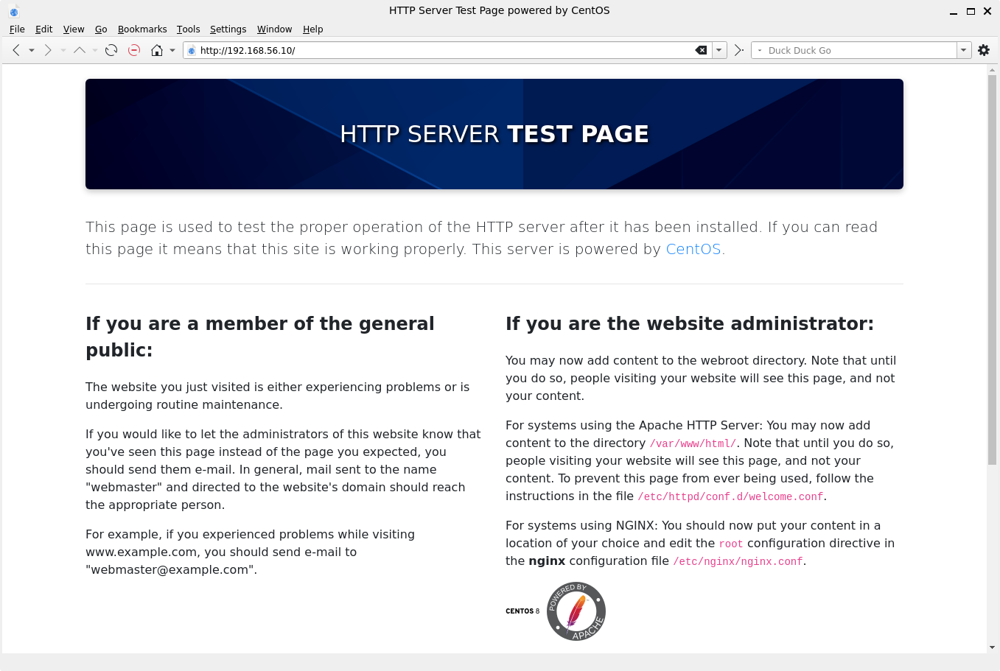
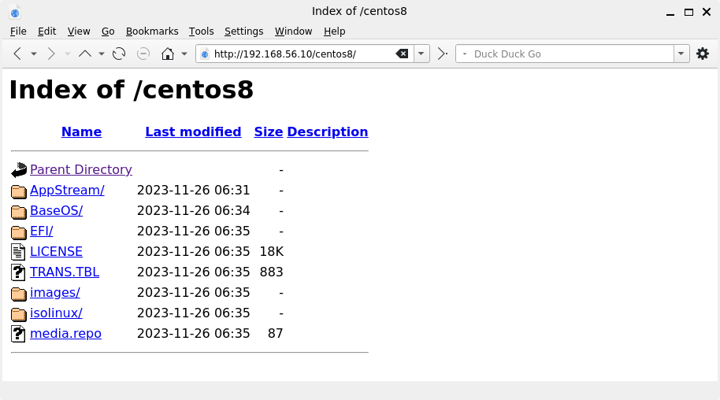
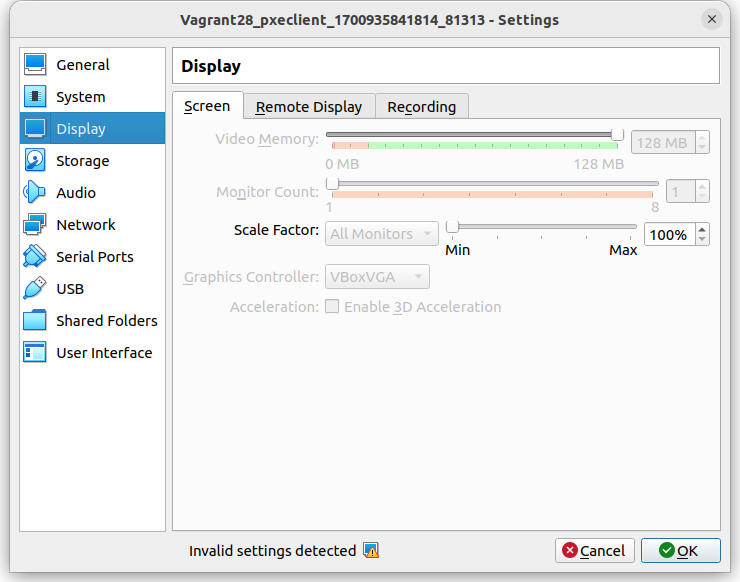
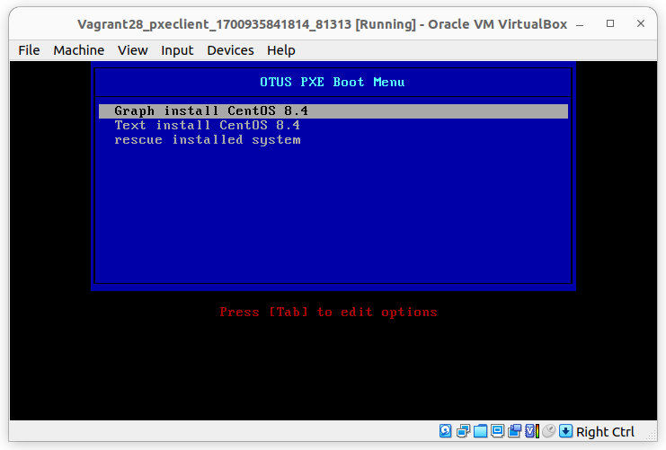
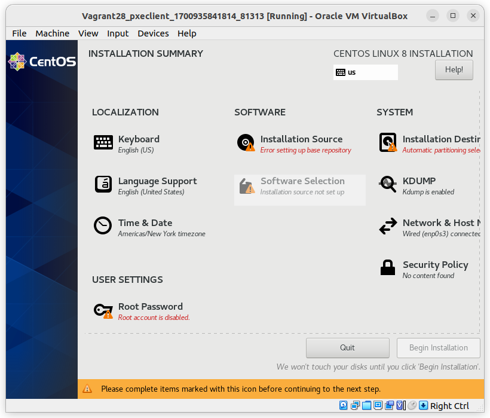
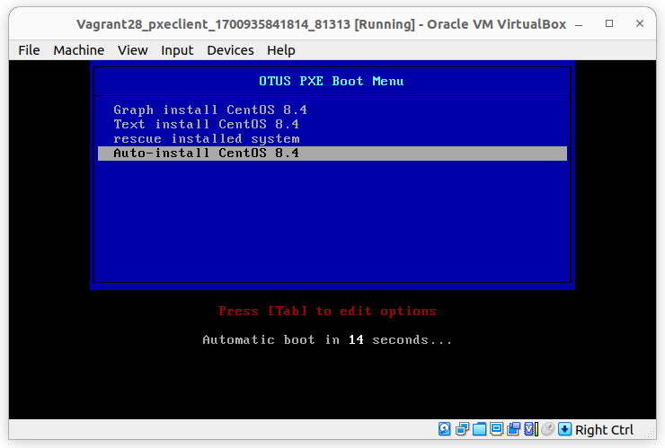
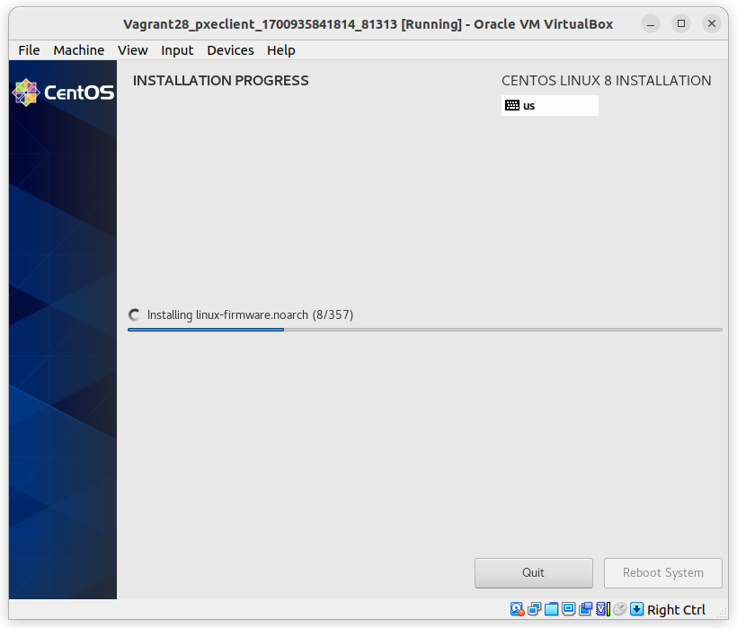

# LESSON 28 - Настройка PXE сервера

## Цель домашнего задания
Отработать навыки установки и настройки DHCP, TFTP, PXE загрузчика и автоматической загрузки

## Описание домашнего задания

1. Следуя шагам из документа https://docs.centos.org/en-US/8-docs/advanced-install/assembly_preparing-for-a-network-install  установить и настроить загрузку по сети для дистрибутива CentOS 8.
В качестве шаблона воспользуйтесь репозиторием https://github.com/nixuser/virtlab/tree/main/centos_pxe 
2. Поменять установку из репозитория NFS на установку из репозитория HTTP.
3. Настроить автоматическую установку для созданного kickstart файла (*) Файл загружается по HTTP.

## Введение
Бывают ситуации, когда ИТ-специалисту потребуется переустановить ОС на большом количестве хостов. Переустановка вручную потребует от специалиста большого количества времени. В этот момент стоит обратить внимание на PXE.
**PXE (Preboot eXecution Environment)** — это набор протоколов, которые позволяют загрузить хост из сети. Для загрузки будет использоваться сетевая карта хоста.

**Для PXE требуется:**

Со стороны клиента (хоста на котором будем устанавливать или загружать ОС):
Cетевая карта, которая поддерживает стандарт PXE
Со стороны сервера:
DHCP-сервер
TFTP-сервер

**TFTP (Trivial File Transfer Protocol)** — простой протокол передачи файлов, используется главным образом для первоначальной загрузки бездисковых рабочих станций. Основная задача протокола TFTP — отправка указанных файлов клиенту.
TFTP работает на 69 UDP порту. TFTP — очень простой протокол, у него нет аутентификации, возможности удаления файлов и т д. Протокол может только отправлять запросы на чтение и запись…

**DHCP (Dynamic Host Configuration Protocol)** — протокол динамической настройки узла, позволяет сетевым устройствам автоматически получать IP-адрес и другие параметры, необходимые для работы в сети TCP/IP. 
Протокол DHCP пришёл на смену протоколу BOOTP. DHCP сохраняет обратную совместимость с BOOTP. Основное отличие протоколов заключается в том, что протокол DHCP помимо IP-адреса может отправлять клиенту дополнительные опции (маску подсети, адреса DNS-серверов, имя домена, адрес TFTP-сервера). 

Протокол DHCP использует следующие порты:
- UDP 67 на сервере
- UDP 68 на клиенте

Также DHCP позволяет DHCP-клиенту отправить ответом опции для DHCP-сервера.

Через DHCP мы можем передать клиенту адрес PXE-сервера и имя файла, к которому мы будем обращаться.

## 1. Работа с шаблоном из задания:
Скачиваем файлы, указанные в домашнем задании. Рассмотрим Vagrantfile:
```Ruby
# export VAGRANT_EXPERIMENTAL="disks"
Vagrant.configure("2") do |config|

  config.vm.define "pxeserver" do |server|
    server.vm.box = 'bento/centos-8.4'
    server.vm.disk :disk, size: "15GB", name: "extra_storage1"
  
    server.vm.host_name = 'pxeserver'
    server.vm.network :private_network, ip: "10.0.0.20", virtualbox__intnet: 'pxenet'
    server.vm.network :private_network, ip: "192.168.56.10", adapter: 3
    server.vm.network "forwarded_port", guest: 80, host: 8081
  
    server.vm.provider "virtualbox" do |vb|
      vb.memory = "1024"
      vb.customize ["modifyvm", :id, "--natdnshostresolver1", "on"]
    end
  end
  
  # config used from this
  # https://github.com/eoli3n/vagrant-pxe/blob/master/client/Vagrantfile
    config.vm.define "pxeclient" do |pxeclient|
      pxeclient.vm.box = 'bento/centos-8.4'
      pxeclient.vm.host_name = 'pxeclient'
      pxeclient.vm.network :private_network, ip: "10.0.0.21", virtualbox__intnet: 'pxenet'
      pxeclient.vm.provider :virtualbox do |vb|
        vb.memory = "2048"
        vb.customize ["modifyvm", :id, "--natdnshostresolver1", "on"]
        vb.customize [
            'modifyvm', :id,
            '--nic1', 'intnet',
            '--intnet1', 'pxenet',
            '--nic2', 'nat',
            '--boot1', 'net',
            '--boot2', 'none',
            '--boot3', 'none',
            '--boot4', 'none'
          ]
      vb.customize ["modifyvm", :id, "--natdnshostresolver1", "on"]
      end
    end  
end
```
Выполнение команды **vagrunt up** закончится с ошибкой, так как на Pxeclient настроена загрузка по сети.

## 2. Настройка Web-сервера:
Для того, чтобы отдавать файлы по HTTP нам потребуется настроенный веб-сервер.

Процесс настройки вручную: 
Так как у CentOS 8 закончилась поддержка, для установки пакетов нам потребуется поменять репозиторий. Сделать это можно с помощью следующих команд:
```bash
sed -i 's/mirrorlist/#mirrorlist/g' /etc/yum.repos.d/CentOS-Linux-*
sed -i 's|#baseurl=http://mirror.centos.org|baseurl=http://vault.centos.org|g' /etc/yum.repos.d/CentOS-Linux-*
```
2.1 Устанавливаем Web-сервер Apache:
```bash
yum install httpd -y
```
2.2 Далее скачиваем образ CentOS 8.4.2150:
```bash
wget https://mirror.nsc.liu.se/centos-store/8.4.2105/isos/x86_64/CentOS-8.4.2105-x86_64-dvd1.iso 
```
!Внимание: образ имеет размер более 9Гб, скачивание может занять длительное время.
2.3 Монтируем образ:
```bash
mount -t iso9660 CentOS-8.4.2105-x86_64-dvd1.iso /mnt -o loop,ro
```
2.4 Создаём каталог /iso и копируем в него содержимое данного каталога:
```bash
mkdir /iso
cp -r /mnt/* /iso
```
2.5 Ставим права 755 на каталог /iso:
```bash
chmod -R 755 /iso
```
2.6 Настраиваем доступ по HTTP для файлов из каталога /iso:
 - Создаем конфигурационный файл: **vim /etc/httpd/conf.d/pxeboot.conf**
 - Добавляем следующее содержимое в файл:
 ```html
 Alias /centos8 /iso
<Directory /iso>
    Options Indexes FollowSymLinks
    Require all granted
</Directory>
 ```
 - Перезапускаем веб-сервер: **systemctl restart httpd**
 - Добавляем его в автозагрузку: **systemctl enable httpd**
2.7 Проверяем, что веб-сервер работает и каталог /iso доступен по сети:
С вашего компьютера сначала подключаемся к тестовой странице Apache: 

Далее проверям доступность файлов по сети:

Файлы в доступны, веб-сервер настроен корректно.

## 3. Настройка TFTP-сервера
TFTP-сервер потребуется для отправки первичных файлов загрузки (vmlinuz, initrd.img и т. д.)
3.1 Устанавливаем tftp-сервер: **yum install tftp-server**
3.2 Запускаем службу: **systemctl start tftp.service**
3.3 Проверяем, в каком каталоге будут храниться файлы, которые будет отдавать TFTP-сервер:
```bash
[root@pxeserver /]# systemctl status tftp.service
● tftp.service - Tftp Server
   Loaded: loaded (/usr/lib/systemd/system/tftp.service; indirect; vendor preset: disabled)
   Active: inactive (dead) since Sun 2023-11-26 08:05:23 UTC; 1h 5min ago
     Docs: man:in.tftpd
  Process: 4759 ExecStart=/usr/sbin/in.tftpd -s /var/lib/tftpboot (code=exited, status=0/SUCCESS)
 Main PID: 4759 (code=exited, status=0/SUCCESS)

Nov 26 07:50:21 pxeserver systemd[1]: Started Tftp Server.
Nov 26 08:05:23 pxeserver systemd[1]: tftp.service: Succeeded.
```
В статусе видим, что рабочий каталог **/var/lib/tftpboot**
3.4 Созаём каталог, в котором будем хранить наше меню загрузки:
```bash
mkdir /var/lib/tftpboot/pxelinux.cfg
```
3.5 Создаём меню-файл: **vim /var/lib/tftpboot/pxelinux.cfg/default**
```
default menu.c32
prompt 0
timeout 150
ONTIME local
menu title OTUS PXE Boot Menu
       label 1
       menu label ^ Graph install CentOS 8.4
       kernel /vmlinuz
       initrd /initrd.img
       append ip=enp0s3:dhcp inst.repo=http://10.0.0.20/centos8
       label 2
       menu label ^ Text install CentOS 8.4
       kernel /vmlinuz
       initrd /initrd.img
       append ip=enp0s3:dhcp inst.repo=http://10.0.0.20/centos8 text
       label 3
       menu label ^ rescue installed system
       kernel /vmlinuz
       initrd /initrd.img
       append ip=enp0s3:dhcp inst.repo=http://10.0.0.20/centos8 rescue
```
Label 1-3 различаются только дополнительными параметрами:
 - **label** 1 — установка вручную в графическом режиме;
 - **label** 2 — установка вручную в текстовом режиме;
 - **label** 3 — восстановление системы.

 3.6 Распакуем файл syslinux-tftpboot-6.04-5.el8.noarch.rpm:
 ```
 rpm2cpio /iso/BaseOS/Packages/syslinux-tftpboot-6.04-5.el8.noarch.rpm | cpio -dimv
 ```
 3.7 После распаковки в каталоге пользователя root будет создан каталог tftpboot из которого потребуется скопировать следующие файлы:
 - pxelinux.0
 - ldlinux.c32
 - libmenu.c32
 - libutil.c32
 - menu.c32
 - vesamenu.c32
```bash
cd tftpboot
cp pxelinux.0 ldlinux.c32 libmenu.c32 libutil.c32 menu.c32 vesamenu.c32 /var/lib/tftpboot/
```
3.8 Также в каталог /var/lib/tftpboot/ нам потребуется скопировать файлы initrd.img и vmlinuz, которые располагаются в каталоге /iso/images/pxeboot/:
```bash
cp /iso/images/pxeboot/{initrd.img,vmlinuz} /var/lib/tftpboot/
```
3.9 перезапускаем TFTP-сервер и добавляем его в автозагрузку:
```bash
systemctl restart tftp.service 
systemctl enable tftp.service
```

## 4. Настройка DHCP-сервера:
4.1 Устанавливаем DHCP-сервер: **yum install dhcp-server**
4.2 Правим конфигурационный файл: **vim /etc/dhcp/dhcpd.conf**
```
option space pxelinux;
option pxelinux.magic code 208 = string;
option pxelinux.configfile code 209 = text;
option pxelinux.pathprefix code 210 = text;
option pxelinux.reboottime code 211 = unsigned integer 32;
option architecture-type code 93 = unsigned integer 16;


subnet 10.0.0.0 netmask 255.255.255.0 {
       
        #option routers 10.0.0.1;
        
        range 10.0.0.100 10.0.0.120;
		
        class "pxeclients" {
          match if substring (option vendor-class-identifier, 0, 9) = "PXEClient";
         
          next-server 10.0.0.20;
        
          filename "pxelinux.0";
        }
}
```
На данном этапе мы закончили настройку PXE-сервера для ручной установки сервера. Давайте попробуем запустить процесс установки вручную, для удобства воспользуемся установкой через графический интерфейс:

В настройках виртуальной машины pxeclient рекомендуется поменять графический контроллер на VMSVGA и добавить видеопамяти. Видеопамять должна стать 20 МБ или больше.  
  
С такими настройками картинка будет более плавная и не будет постоянно мигать.
Нажимаем **ОК**, выходим из настроек ВМ и запускаем её.

Выбираем графическую установку

После этого, будут скачаны необходимые файлы с веб-сервера

Как только появится окно установки, нам нужно будет поочереди пройти по всем компонентам и указать с какими параметрами мы хотим установить ОС:
  
Иногда с разделом **Installation Source** случаются проблемы, и репозиторий не подтягивается автоматически. В этом случае нужно руками указать адрес репозитория: http://10.0.0.20/centos8/BaseOS 

После установки всех, нужных нам параметров нажимаем Begin installation
После этого начнётся установка системы, после установки всех компонентов нужно будет перезагрузить ВМ и запуститься с диска. 

Если нам не хочется вручную настраивать каждую установку, то мы можем автоматизировать этот процесс с помощью файла автоматиеской установки (kickstart file)

## 5. Настройка автоматической установки с помощью Kickstart-файла
5.1 Создаем kickstart-файл и кладём его в каталог к веб-серверу: **vim /iso/ks.cfg**
```
#version=RHEL8
ignoredisk --only-use=sda
autopart --type=lvm
clearpart --all --initlabel --drives=sda
graphical
keyboard --vckeymap=us --xlayouts='us'
lang en_US.UTF-8
url --url=http://10.0.0.20/centos8/BaseOS/
network --bootproto=dhcp --device=enp0s3 --ipv6=auto --activate
network --bootproto=dhcp --device=enp0s8 --onboot=off --ipv6=auto --activate
network --hostname=otus-pxe-client
rootpw --iscrypted $6$sJgo6Hg5zXBwkkI8$btrEoWAb5FxKhajagWR49XM4EAOfO/Dr5bMrLOkGe3KkMYdsh7T3MU5mYwY2TIMJpVKckAwnZFs2ltUJ1abOZ.
firstboot --enable
skipx
services --enabled="chronyd"
timezone Europe/Moscow --isUtc
user --groups=wheel --name=val --password=$6$ihX1bMEoO3TxaCiL$OBDSCuY.EpqPmkFmMPVvI3JZlCVRfC4Nw6oUoPG0RGuq2g5BjQBKNboPjM44.0lJGBc7OdWlL17B3qzgHX2v// --iscrypted --gecos="val"

%packages
@^minimal-environment#version=RHEL8
ignoredisk --only-use=sda
autopart --type=lvm
clearpart --all --initlabel --drives=sda
graphical
keyboard --vckeymap=us --xlayouts='us'
lang en_US.UTF-8
url -url=http://10.0.0.20/centos8/BaseOS/
network  --bootproto=dhcp --device=enp0s3 --ipv6=auto --activate
network  --bootproto=dhcp --device=enp0s8 --onboot=off --ipv6=auto --activate
network  --hostname=otus-pxe-client
rootpw --iscrypted $6$sJgo6Hg5zXBwkkI8$btrEoWAb5FxKhajagWR49XM4EAOfO/Dr5bMrLOkGe3KkMYdsh7T3MU5mYwY2TIMJpVKckAwnZFs2ltUJ1abOZ.
firstboot --enable
skipx
services --enabled="chronyd"
timezone Europe/Moscow --isUtc
user --groups=wheel --name=val --password=$6$ihX1bMEoO3TxaCiL$OBDSCuY.EpqPmkFmMPVvI3JZlCVRfC4Nw6oUoPG0RGuq2g5BjQBKNboPjM44.0lJGBc7OdWlL17B3qzgHX2v// --iscrypted --gecos="val"
%packages
@^minimal-environment
kexec-tools
%end
%addon com_redhat_kdump --enable --reserve-mb='auto'
%end
%anaconda
pwpolicy root --minlen=6 --minquality=1 --notstrict --nochanges --notempty
pwpolicy user --minlen=6 --minquality=1 --notstrict --nochanges --emptyok
pwpolicy luks --minlen=6 --minquality=1 --notstrict --nochanges --notempty
%end
kexec-tools

%end

%addon com_redhat_kdump --enable --reserve-mb='auto'

%end

%anaconda
pwpolicy root --minlen=6 --minquality=1 --notstrict --nochanges --notempty
pwpolicy user --minlen=6 --minquality=1 --notstrict --nochanges --emptyok
pwpolicy luks --minlen=6 --minquality=1 --notstrict --nochanges --notempty
%end
```
5.2 Добавляем меню загрузки в конец файла **/var/lib/tftpboot/pxelinux.cfg/default**
```
       label 4
       menu label ^ Auto-install CentOS 8.4
       menu default
       kernel /vmlinuz
       initrd /initrd.img
       append ip=enp0s3:dhcp inst.ks=http://10.0.0.20/centos8/ks.cfg inst.repo=http://10.0.0.20/centos8/
```
В append появляется дополнительный параметр inst.ks, в котором указан адрес kickstart-файла. 
После внесения данных изменений, можем перезапустить нашу ВМ pxeclient и проверить, что запустится процесс автоматической установки ОС.


  
Установка системы в автоматическом режиме начата.