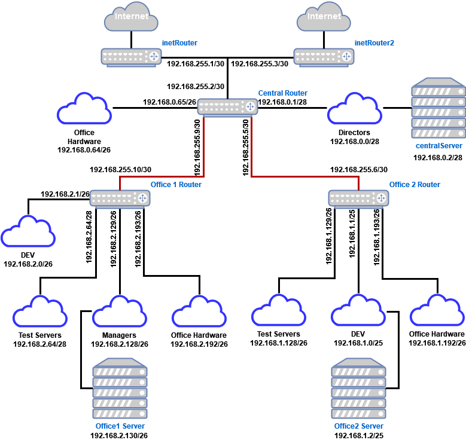
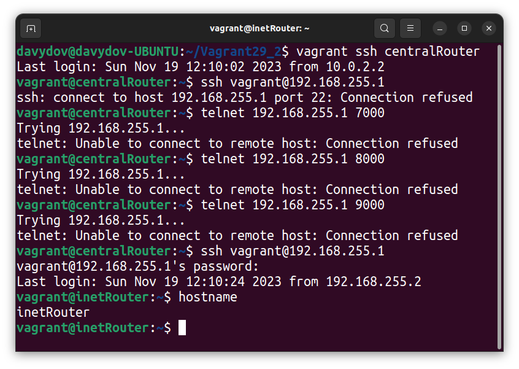
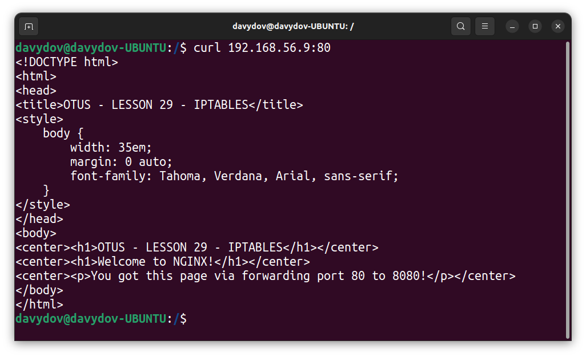

# LESSON 29 - Фильтрация трафика iptables

## Задача:
1. Реализовать knocking port
    -  centralRouter может попасть на ssh inetrRouter через knock скрипт.
2. Добавить inetRouter2, который виден(маршрутизируется (host-only тип сети для виртуалки)) с хоста или форвардится порт через локалхост.
3. Запустить nginx на centralServer.
4. Пробросить 80й порт на inetRouter2 8080.
5. Дефолт в инет оставить через inetRouter.

## Схема сети:
За основу былая взята архитектура сети из урока 27 с некоторым изменениями:
  - Добавлен роутер **inetRouter2** c host-only адаптером с адресом (192.168.56.9);
  - Удалена подсеть 192.168.0.32/28
  - Исключены маршрутизаторы **Office 1 Router**, **Office 2 Router** и все устройства за ними, т.к. в условиях задачи они не фигурируют.



## PortKnock:
На inetRouter был установлен демон knock, для которого была сформирована следующая конфигурация (knockd.conf):
```
[options]
        logfile = /var/log/knockd.log
        interface = eth1
[openSSH]
        sequence = 7000,8000,9000
        seq_timeout = 30
        tcpflags = syn
        command = /sbin/iptables -I INPUT -s 192.168.255.2 -p tcp --dport 22 -j ACCEPT
[closeSSH]
        sequence = 7001,8001,9001
        seq_timeout = 30
        tcpflags = syn
        command = /sbin/iptables -D INPUT -s 192.168.255.2 -p tcp --dport 22 -j ACCEPT
```

В которой мы определяем интерфейс, который попадает под portknicking eth1 и последовательноть номеров портов, которой будет открывать и закрывать порты, а так же правило, которой будет добавлено или убрано из iptables при приходе серии портов на интерфейс. Т.к. в задаче указано, что правило должно работать только с устройства centralRouter, явно указываем source address: *192.168.255.2*.

Проверяем открытие порта с centralRouter:



Видим, что порт SSH Успешно открыт.

## Изменение и проброс пора до сервера с NGNIX:

Посредством Ansible разворачиваем на centralServer web-сервер NGINX и меняем прослушиваемый порт с 80 на 8080. Добавляем кастомную страницу для проверки работоспособности.

Для **inetRouter2** формируем группу правил:

```bash
# Generated by iptables-save v1.8.7 on Sun Nov 19 08:12:49 2023
*filter
:INPUT DROP [0:0]
:FORWARD ACCEPT [273:31324]
:OUTPUT ACCEPT [0:0]
-A INPUT -m state --state INVALID -j DROP
-A INPUT -i lo -j ACCEPT
-A INPUT -m state --state RELATED,ESTABLISHED -j ACCEPT
-A INPUT -p icmp -j ACCEPT
-A INPUT -p tcp -m tcp --dport 22 -j ACCEPT
-A INPUT -p tcp -m tcp --dport 80 -j ACCEPT
COMMIT
# Completed on Sun Nov 19 08:12:49 2023
# Generated by iptables-save v1.8.7 on Sun Nov 19 08:12:49 2023
*nat
:PREROUTING ACCEPT [0:0]
:INPUT ACCEPT [0:0]
:OUTPUT ACCEPT [0:0]
:POSTROUTING ACCEPT [0:0]
-A PREROUTING -d 192.168.56.9/32 -p tcp -m tcp --dport 80 -j DNAT --to-destination 192.168.0.2:8080
-A POSTROUTING -d 192.168.0.2/32 -j SNAT --to-source 192.168.255.13
COMMIT
# Completed on Sun Nov 19 08:12:49 2023
```

В которых устанавливаем политику для цепочки **INPUT** как **DROP** и открываем только порты 22 и 80, а в таблице **nat** задаем для пакета, пришедшего на 192.168.56.9 *(host-only)* перенаправление на 192.168.0.2 (centralServer) по порту 8080.

Попробуем получить html-страницу из под машины хоста, постучавшись на порт 80 по адресу 192.168.56.9:


Видим, что страница успешно была получена.