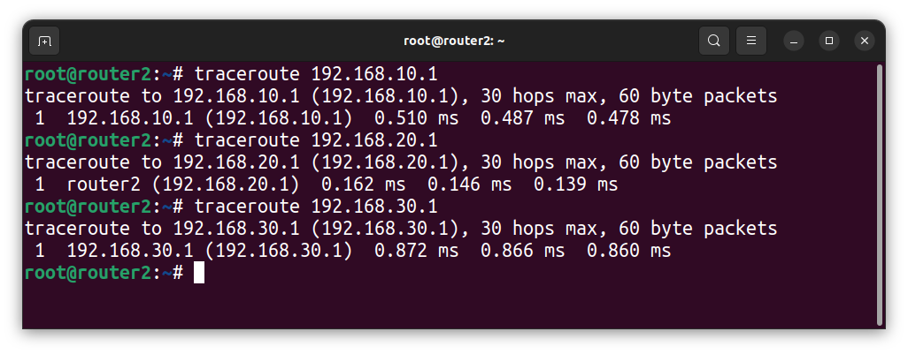

# LESSON 32 - OSPF статическая и динамическая маршрутизация

## Цель домашнего задания:
- Создать домашнюю сетевую лабораторию. Научится настраивать протокол OSPF в Linux-based системах.

## Описание домашнего задания^
1. Развернуть 3 виртуальные машины
2. Объединить их разными vlan
    - настроить OSPF между машинами на базе Quagga;
    - изобразить ассиметричный роутинг;
    - сделать один из линков "дорогим", но что бы при этом роутинг был симметричным.

## Введение:
**OSPF** — протокол динамической маршрутизации, использующий концепцию разделения на области в целях масштабирования. 
Административная дистанция OSPF — 110
Основные свойства протокола OSPF:
- Быстрая сходимость
- Масштабируемость (подходит для маленьких и больших сетей)
- Безопасность (поддежка аутентиикации)
- Эффективность (испольование алгоритма поиска кратчайшего пути)

При настроенном OSPF маршрутизатор формирует таблицу топологии с использованием результатов вычислений, основанных на алгоритме кратчайшего пути (SPF) Дейкстры. Алгоритм поиска кратчайшего пути основывается на данных о совокупной стоимости доступа к точке назначения. Стоимость доступа определятся на основе скорости интерфейса. 
Чтобы повысить эффективность и масштабируемость OSPF, протокол поддерживает иерархическую маршрутизацию с помощью областей (area). 

**Область OSPF (area)** — Часть сети, которой ограничивается формирование базы данных о состоянии каналов. Маршрутизаторы, находящиеся в одной и той же области, имеют одну и ту же базу данных о топологии сети. Для определения областей применяются идентификаторы областей.

Протоколы OSPF бывают 2-х версий: 
- OSPFv2
- OSPFv3

Основным отличием протоколов является то, что OSPFv2 работает с IPv4, а OSPFv3 — c IPv6. 
Маршрутизаторы в OSPF классифицируются на основе выполняемой ими функции:


- **Internal router (внутренний маршрутизатор)** — маршрутизатор, все интерфейсы которого находятся в одной и той же области.
- **Backbone router (магистральный маршрутизатор)** — это маршрутизатор, который находится в магистральной зоне (area 0).
- **ABR (пограничный маргрутизатор области)** — маршрутизатор, интерфейсы которого подключены к разным областям.
- **ASBR (Граничный маршрутизатор автономной системы)** — это маршрутизатор, у которого интерфейс подключен к внешней сети.

Также с помощью OSPF можно настроить ассиметричный роутинг.
Ассиметричная маршрутизация — возможность пересекать сеть в одном направлении, используя один путь, и возвращаться через другой путь.

## 1. Разворачиваем вираутальные машины:
Так как мы планируем настроить OSPF, все 3 виртуальные машины должны быть соединены между собой (разными VLAN), а также иметь одну (или несколько) доолнительных сетей, к которым, далее OSPF сформирует маршруты. Исходя из данных требований, мы можем нарисовать топологию сети:


Обратите внимание, сети, указанные на схеме не должны использоваться в Oracle Virtualbox, иначе Vagrant не сможет собрать стенд и зависнет. По умолчанию Virtualbox использует сеть 10.0.2.0/24.

Файл Vagrant имеет следующее содержание:
```RUBY
MACHINES = {
  :router1 => {
        :box_name => "generic/ubuntu2204",
        :vm_name => "router1",
        #:public => {:ip => "10.10.10.1", :adapter => 1},
        :net => [   
                    #ip, adpter, netmask, virtualbox__intnet
                    ["192.168.10.1", 2, "255.255.255.0", "net1"], 
                    ["10.0.12.1", 3, "255.255.255.252", "r1-r3"], 
                    ["10.0.10.1", 4, "255.255.255.252", "r1-r2"], 
                    ["192.168.56.10", 8, "255.255.255.0"],
                ]
  },

  :router2 => {
        :box_name => "generic/ubuntu2204",
        :vm_name => "router2",
        #:public => {:ip => "10.10.10.1", :adapter => 1},
        :net => [   
                    #ip, adpter, netmask, virtualbox__intnet
                    ["192.168.20.1", 2, "255.255.255.0", "net2"], 
                    ["10.0.11.2", 3, "255.255.255.252", "r2-r3"], 
                    ["10.0.10.2", 4, "255.255.255.252", "r1-r2"], 
                    ["192.168.56.20", 8, "255.255.255.0"],
                ]
  },

  :router3 => {
        :box_name => "generic/ubuntu2204",
        :vm_name => "router3",
        :net => [
                    ["192.168.30.1", 2, "255.255.255.0", "net3"], 
                    ["10.0.12.2", 3, "255.255.255.252", "r1-r3"], 
                    ["10.0.11.1", 4, "255.255.255.252", "r2-r3"], 
                    ["192.168.56.30", 8, "255.255.255.0"],
                ]
  }
}

Vagrant.configure("2") do |config|

  MACHINES.each do |boxname, boxconfig|

    config.vm.define boxname do |box|
   
      box.vm.box = boxconfig[:box_name]
      box.vm.host_name = boxconfig[:vm_name]

      box.vm.provider "virtualbox" do |v|
        v.memory = 768
        v.cpus = 1
       end

       if boxconfig[:vm_name] == "router3"
        box.vm.provision "ansible" do |ansible|
         ansible.playbook = "ansible/playbook.yml"
         ansible.inventory_path = "ansible/hosts"
         ansible.host_key_checking = "false"
         ansible.limit = "all"
        end
       end

      boxconfig[:net].each do |ipconf|
        box.vm.network("private_network", ip: ipconf[0], adapter: ipconf[1], netmask: ipconf[2], virtualbox__intnet: ipconf[3])
      end

      if boxconfig.key?(:public)
        box.vm.network "public_network", boxconfig[:public]
      end

      box.vm.provision "shell", inline: <<-SHELL
        mkdir -p ~root/.ssh
        cp ~vagrant/.ssh/auth* ~root/.ssh
      SHELL
    end
  end
end
```

## 2.1 Настройка OSPF между машинами на базе FRR

Процесс установки FRR и настройки OSPF вручную:
1. Отключаем файерволл ufw и удаляем его из автозагрузки:
```bash
systemctl stop ufw 
systemctl disable ufw
```

2. Добавляем gpg ключ:
```bash
curl -s https://deb.frrouting.org/frr/keys.asc | sudo apt-key add -
```


3. Добавляем репозиторий c пакетом FRR:
```bash
echo deb https://deb.frrouting.org/frr $(lsb_release -s -c) frr-stable > /etc/apt/sources.list.d/frr.list
```

4. Обновляем пакеты и устанавливаем FRR:
```bash
   sudo apt update
   sudo apt install frr frr-pythontools
```

5. Разрешаем (включаем) маршрутизацию транзитных пакетов:
```bash
sysctl net.ipv4.conf.all.forwarding=1
```

6. Включаем демон ospfd в FRR
Для этого открываем в редакторе файл **/etc/frr/daemons** и меняем в нём параметры для пакетов **zebra** и **ospfd** на **yes**:

```bash
ospfd=yes
```

7. Настройка OSPF
Для настройки OSPF нам потребуется создать файл **/etc/frr/frr.conf** который будет содержать в себе информацию о требуемых интерфейсах и OSPF. Разберем пример создания файла на хосте router1.

Для начала нам необходимо узнать имена интерфейсов и их адреса.
```
root@router3:~# vtysh 

Hello, this is FRRouting (version 9.0.1).
Copyright 1996-2005 Kunihiro Ishiguro, et al.

router3# show interface brief 
Interface       Status  VRF             Addresses
---------       ------  ---             ---------
eth0            up      default         10.0.2.15/24
eth1            up      default         192.168.30.1/24
eth2            up      default         10.0.12.2/30
eth3            up      default         10.0.11.1/30
eth4            up      default         192.168.56.30/24
lo              up      default         
```
В обоих примерах мы увидем имена сетевых интерфейсов, их ip-адреса и маски подсети.  
Создаём файл **/etc/frr/frr.conf** и вносим в него следующую информацию:
```
rr version 8.1
frr defaults traditional
!
hostname router3
log syslog informational
no ipv6 forwarding
service integrated-vtysh-config
!
interface eth2
description r1-r3
ip address 10.0.12.2/30
ip ospf mtu-ignore
!ip ospf cost 1000
ip ospf hello-interval 10
ip ospf dead-interval 30
!
interface eth3
description r2-r3
ip address 10.0.11.1/30
ip ospf mtu-ignore
!ip ospf cost 45
ip ospf hello-interval 10
ip ospf dead-interval 30
!
interface eth1
description net_router3
ip address 192.168.30.1/24
ip ospf mtu-ignore
!ip ospf cost 45
ip ospf hello-interval 10
ip ospf dead-interval 30
!
router ospf
!
router-id 3.3.3.3
network 10.0.12.0/30 area 0
network 10.0.11.0/30 area 0
network 192.168.30.0/24 area 0
!
neighbor 10.0.12.1
neighbor 10.0.11.2

log file /var/log/frr/frr.log
default-information originate always
```
Сохраняем изменения и выходим из данного файла. 

Вместо файла frr.conf мы можем задать данные параметры вручную из vtysh. Vtysh использует cisco-like команды.
 
На хостах router1 и router2 также потребуется настроить конфигруационные файлы, предварительно поменяв ip-адреса интерфейсов. 

В ходе создания файла мы видим несколько OSPF-параметров, которые требуются для настройки:
**hello-interval** — интервал который указывает через сколько секунд протокол OSPF будет повторно отправлять запросы на другие роутеры. Данный интервал должен быть одинаковый на всех портах и роутерах, между которыми настроен OSPF. 
**Dead-interval** — если в течении заданного времени роутер не отвечает на запросы, то он считается вышедшим из строя и пакеты уходят на другой роутер (если это возможно). Значение должно быть кратно hello-интервалу. Данный интервал должен быть одинаковый на всех портах и роутерах, между которыми настроен OSPF.
**router-id** — идентификатор маршрутизатора (необязательный параметр), если данный параметр задан, то роутеры определяют свои роли по  данному параметру. Если данный идентификатор не задан, то роли маршрутизаторов определяются с помощью Loopback-интерфейса или самого большого ip-адреса на роутере.

8. После создания файлов **/etc/frr/frr.conf** и **/etc/frr/daemons** нужно проверить, что владельцем файла является пользователь frr. Группа файла также должна быть frr. Должны быть установленны следующие права:
 - у владельца на чтение и запись
 - у группы только на чтение

```bash
chown frr:frr /etc/frr/frr.conf 
chmod 640 /etc/frr/frr.conf 
```

9. Перезапускаем FRR и добавляем его в автозагрузку
```bash
systemct restart frr 
systemctl enable frr
```

Проверяем доступность сетей на каждом из маршрутизаторов:




## 2.2 Настройка ассиметричного роутинга
Для настройки ассиметричного роутинга нам необходимо выключить блокировку ассиметричной маршрутизации: **sysctl net.ipv4.conf.all.rp_filter=0**

Далее, выбираем один из роутеров, на котором изменим «стоимость интерфейса». Например поменяем стоимость интерфейса eth3 (10.0.10.1) на router1:
```
root@router1:~# vtysh 

Hello, this is FRRouting (version 9.0.1).
Copyright 1996-2005 Kunihiro Ishiguro, et al.

router1# conf t
router1(config)# int eth3
router1(config-if)# ip ospf cost 1000
router1(config-if)# exit
```

После внесения данных настроек, мы видим, что маршрут до сети 192.168.20.0/30  теперь пойдёт через router2, но обратный трафик от router2 пойдёт по другому пути. Давайте это проверим:
1. На router1 запускаем пинг от 192.168.10.1 до 192.168.20.1: 
ping -I 192.168.10.1 192.168.20.1
2. На router2 запускаем tcpdump, который будет смотреть трафик только на порту eth2:
```
root@router2:~# tcpdump -i eth2
tcpdump: verbose output suppressed, use -v[v]... for full protocol decode
listening on eth2, link-type EN10MB (Ethernet), snapshot length 262144 bytes
19:27:43.251345 IP 192.168.10.1 > router2: ICMP echo request, id 5, seq 4, length 64
19:27:44.275236 IP 192.168.10.1 > router2: ICMP echo request, id 5, seq 5, length 64
19:27:45.288670 ARP, Request who-has router2 tell 10.0.11.1, length 46
19:27:45.288681 ARP, Reply router2 is-at 08:00:27:67:3e:67 (oui Unknown), length 28
19:27:45.299376 IP 192.168.10.1 > router2: ICMP echo request, id 5, seq 6, length 64
19:27:46.323316 IP 192.168.10.1 > router2: ICMP echo request, id 5, seq 7, length 64
19:27:47.347477 IP 192.168.10.1 > router2: ICMP echo request, id 5, seq 8, length 64
```

3. На router2 запускаем tcpdump, который будет смотреть трафик только на порту eth3:
```
root@router2:~# tcpdump -i eth3
tcpdump: verbose output suppressed, use -v[v]... for full protocol decode
listening on eth3, link-type EN10MB (Ethernet), snapshot length 262144 bytes
19:26:30.899433 IP router2 > 192.168.10.1: ICMP echo reply, id 4, seq 8, length 64
19:26:31.923359 IP router2 > 192.168.10.1: ICMP echo reply, id 4, seq 9, length 64
19:26:32.947448 IP router2 > 192.168.10.1: ICMP echo reply, id 4, seq 10, length 64
19:26:33.971267 IP router2 > 192.168.10.1: ICMP echo reply, id 4, seq 11, length 64
19:26:34.430342 IP 10.0.10.1 > ospf-all.mcast.net: OSPFv2, Hello, length 48
19:26:34.995438 IP router2 > 192.168.10.1: ICMP echo reply, id 4, seq 12, length 64
19:26:36.019269 IP router2 > 192.168.10.1: ICMP echo reply, id 4, seq 13, length 64
```
Видим что данный порт только отправляет ICMP-трафик на адрес 192.168.10.1

Таким образом мы видим ассиметричный роутинг.

## 2.3 Настройка симметичного роутинга
Так как у нас уже есть один «дорогой» интерфейс, нам потребуется добавить ещё один дорогой интерфейс, чтобы у нас перестала работать ассиметричная маршрутизация. 

Так как в прошлом задании мы заметили что router2 будет отправлять обратно трафик через порт eth3, мы также должны сделать его дорогим и далее проверить, что теперь используется симметричная маршрутизация:

Поменяем стоимость интерфейса eth3 на router2.

Выполним проверку: 
1. На router1 запускаем пинг от 192.168.10.1 до 192.168.20.1 
**ping -I 192.168.10.1 192.168.20.1**

```
root@router2:~# tcpdump -i eth2
tcpdump: verbose output suppressed, use -v[v]... for full protocol decode
listening on eth2, link-type EN10MB (Ethernet), snapshot length 262144 bytes
19:42:07.827216 IP 192.168.10.1 > router2: ICMP echo request, id 6, seq 29, length 64
19:42:07.827232 IP router2 > 192.168.10.1: ICMP echo reply, id 6, seq 29, length 64
19:42:08.851229 IP 192.168.10.1 > router2: ICMP echo request, id 6, seq 30, length 64
19:42:08.851249 IP router2 > 192.168.10.1: ICMP echo reply, id 6, seq 30, length 64
19:42:09.704754 IP 10.0.11.1 > ospf-all.mcast.net: OSPFv2, Hello, length 48
19:42:09.875195 IP 192.168.10.1 > router2: ICMP echo request, id 6, seq 31, length 64
19:42:09.875205 IP router2 > 192.168.10.1: ICMP echo reply, id 6, seq 31, length 64
19:42:10.899235 IP 192.168.10.1 > router2: ICMP echo request, id 6, seq 32, length 64
19:42:10.899256 IP router2 > 192.168.10.1: ICMP echo reply, id 6, seq 32, length 64
19:42:11.923274 IP 192.168.10.1 > router2: ICMP echo request, id 6, seq 33, length 64
19:42:11.923296 IP router2 > 192.168.10.1: ICMP echo reply, id 6, seq 33, length 64
19:42:12.924579 IP 192.168.10.1 > router2: ICMP echo request, id 6, seq 34, length 64
19:42:12.924598 IP router2 > 192.168.10.1: ICMP echo reply, id 6, seq 34, length 64
```
Теперь мы видим, что трафик между роутерами ходит симметрично.