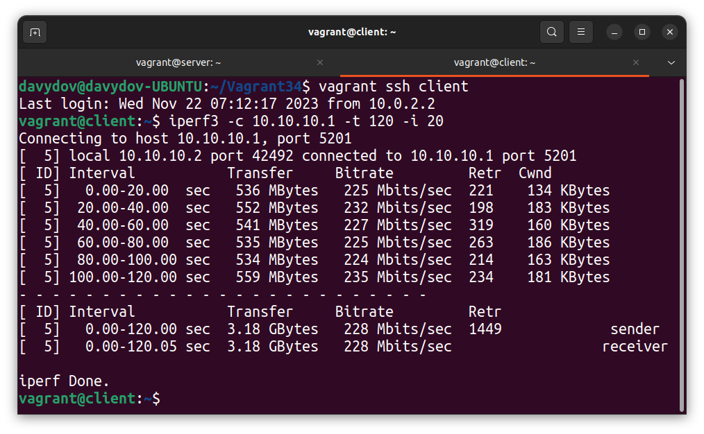
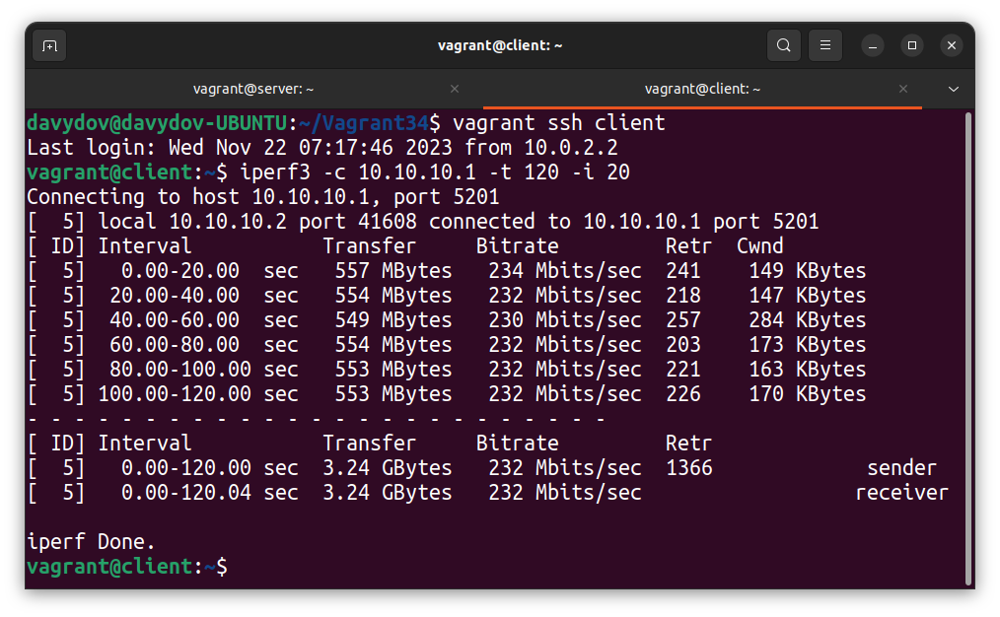
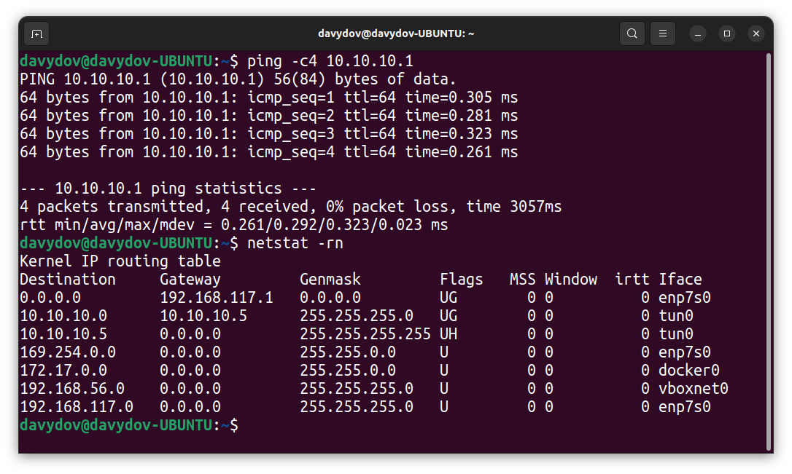

# LESSON 34 - Мосты, туннели и VPN

## Задача:
1. Между двумя виртуалками поднять vpn в режимах
    - tun;
    - tap;
    - прочуствовать разницу.

2. Поднять RAS на базе OpenVPN с клиентскими сертификатами, подключиться с локальной машины на виртуалку.

## 1. Поднимаем OpenVPN:
### 1.1 Для развертывания двух вирутальных машин "server" и "client" испольуем следующий Vagrant-файл:
```Ruby
MACHINES = {
  :server => {
        :box_name => "generic/ubuntu2204",
        :vm_name => "server",
        :net => [  ["192.168.56.10"],  ]
  },

  :client => {
        :box_name => "generic/ubuntu2204",
        :vm_name => "client",
        :net => [  ["192.168.56.20"],  ]
  }
}

Vagrant.configure("2") do |config|

  MACHINES.each do |boxname, boxconfig|

    config.vm.define boxname do |box|
   
      box.vm.box = boxconfig[:box_name]
      box.vm.host_name = boxconfig[:vm_name]

      box.vm.provider "virtualbox" do |v|
        v.memory = 768
        v.cpus = 1
       end

       if boxconfig[:vm_name] == "client"
        box.vm.provision "ansible" do |ansible|
         ansible.playbook = "ansible/playbook.yml"
         ansible.inventory_path = "ansible/hosts"
         ansible.host_key_checking = "false"
         ansible.limit = "all"
        end
       end

      boxconfig[:net].each do |ipconf|
        box.vm.network("private_network", ip: ipconf[0])
      end

    end
  end
end
```

### 1.2 Устанавливаем на оба хоста **iperf3** и **openvpm**
```bash
apt install openvpn iperf3 -y
```

### 1.3 Выполняем настройку сервера:
 - Генерируем файл-ключ:
 ```bash
 openvpn --genkey --secret /etc/openvpn/static.key
 ```
 - Создаём конфигурационный файл VPN-сервера:
 ```bash
 vim /etc/openvpn/server.conf
 ```
- server.conf должен иметь следующий вид:
```
dev tap
ifconfig 10.10.10.1 255.255.255.0
topology subnet
secret /etc/openvpn/static.key
comp-lzo
status /var/log/openvpn-status.log
log /var/log/openvpn.log
verb 3
```
- Запускаем openvpn-сервер и добаляем в автозапуск:
```bash
systemctl start openvpn@server.service
systemctl enable openvpn@server.service
```

### 1.4 Настраиваем клиента:
- Создаём конфигурационный файл клиента:
 ```bash
 vim /etc/openvpn/server.conf
 ```
 - Файл должен иметь следующую конфигурацию:
 ```
dev tap
remote 192.168.56.10
ifconfig 10.10.10.2 255.255.255.0
topology subnet
route 192.168.56.0. 255.255.255.0
secret /etc/openvpn/static.key
comp-lzo
status /var/log/openvpn-status.log
log /var/log/openvpn.log
verb 3
 ```
 - Копируем файл /etc/openvpn/static.key, созданный на сервере в аналогичную директорию на клиенискую машину.
- Запускаем openvpn-клиент и добаляем в автозапуск:
```bash
systemctl start openvpn@server.service
systemctl enable openvpn@server.service
```
 
 ### 1.5 Проверка работоспособности и скорости VPN-канала в двух режимах, tap и tun:
 - На сервере OpenVPN запускаем iperf3 в режиме сервера:
 ```
iperf3 -s
 ```
 - На OpenVPN клиенте запускаем iperf3 в режиме клиента и получаем результат со скорости в туннеле:
 
 - Для изменения режимы работы интерфейся в server.conf изменим значние "dev" c tap на tun и перезагрузим оба хоста.
 - Повторим запуск ipertf3 в другом режиме интерфейса:
 

 Как результат: в рамках выполнения эксперимента, в среде вируальных машин, режим работы tun показал немного большую пропускную способность канала.

## 2. RAS на базе OpenVPN:
Для выполнения задания используем тот же самый Vagrant-файл, только оставляем только одну вирутальную машину.
### 2.1 Установка дополнительных пакетов:
```bash
apt install easy-rsa -y
```
### 2.2 Инициализируем PKI:
```bash
root@server:~# cd /etc/openvpn/
root@server:/etc/openvpn# /usr/share/easy-rsa/easyrsa init-pki

init-pki complete; you may now create a CA or requests.
Your newly created PKI dir is: /etc/openvpn/pki
```
### 2.3 Генерируем необходимые ключи и сертификаты для сервера:
```bash
root@server:/etc/openvpn# echo 'rasvpn' | /usr/share/easy-rsa/easyrsa build-ca nopass
Using SSL: openssl OpenSSL 3.0.2 15 Mar 2022 (Library: OpenSSL 3.0.2 15 Mar 2022)
You are about to be asked to enter information that will be incorporated
into your certificate request.
What you are about to enter is what is called a Distinguished Name or a DN.
There are quite a few fields but you can leave some blank
For some fields there will be a default value,
If you enter '.', the field will be left blank.
-----
Common Name (eg: your user, host, or server name) [Easy-RSA CA]:
CA creation complete and you may now import and sign cert requests.
Your new CA certificate file for publishing is at:
/etc/openvpn/pki/ca.crt
```
```bash
root@server:/etc/openvpn# echo 'rasvpn' | /usr/share/easy-rsa/easyrsa gen-req server nopass
Using SSL: openssl OpenSSL 3.0.2 15 Mar 2022 (Library: OpenSSL 3.0.2 15 Mar 2022)
...+...+....+...+...+......+++++++++++++++++++++++++++++++++++++++++++++++++++++++++++++++++*..+.....+....+.....+...+.........+...+.......+........+...+.........+++++++++++++++++++++++++++++++++++++++++++++++++++++++++++++++++*.+...+.....+.............+...+..+++++++++++++++++++++++++++++++++++++++++++++++++++++++++++++++++
........+..+...+.......+++++++++++++++++++++++++++++++++++++++++++++++++++++++++++++++++*.+..+......+....+...........+...+....+.....+++++++++++++++++++++++++++++++++++++++++++++++++++++++++++++++++*....+....+...+..+....+..+....+......+........+........................+...+....+...+...+............+...+.....+...+....+..+.+............+......+.................+..........+..+.+...........+...+...+....+..............+......+......+...............+....+.........+......+...........+............+.+++++++++++++++++++++++++++++++++++++++++++++++++++++++++++++++++
-----
You are about to be asked to enter information that will be incorporated
into your certificate request.
What you are about to enter is what is called a Distinguished Name or a DN.
There are quite a few fields but you can leave some blank
For some fields there will be a default value,
If you enter '.', the field will be left blank.
-----
Common Name (eg: your user, host, or server name) [server]:
Keypair and certificate request completed. Your files are:
req: /etc/openvpn/pki/reqs/server.req
key: /etc/openvpn/pki/private/server.key
```
```bash
root@server:/etc/openvpn# echo 'yes' | /usr/share/easy-rsa/easyrsa sign-req server server
Using SSL: openssl OpenSSL 3.0.2 15 Mar 2022 (Library: OpenSSL 3.0.2 15 Mar 2022)


You are about to sign the following certificate.
Please check over the details shown below for accuracy. Note that this request
has not been cryptographically verified. Please be sure it came from a trusted
source or that you have verified the request checksum with the sender.

Request subject, to be signed as a server certificate for 825 days:

subject=
    commonName                = rasvpn


Type the word 'yes' to continue, or any other input to abort.
  Confirm request details: Using configuration from /etc/openvpn/pki/easy-rsa-1156.NQSI9l/tmp.9kzzOu
4047CAEA0E7F0000:error:0700006C:configuration file routines:NCONF_get_string:no value:../crypto/conf/conf_lib.c:315:group=<NULL> name=unique_subject
Check that the request matches the signature
Signature ok
The Subject's Distinguished Name is as follows
commonName            :ASN.1 12:'rasvpn'
Certificate is to be certified until Feb 24 07:59:51 2026 GMT (825 days)

Write out database with 1 new entries
Data Base Updated

Certificate created at: /etc/openvpn/pki/issued/server.crt
```
```
root@server:/etc/openvpn# /usr/share/easy-rsa/easyrsa gen-dh
Using SSL: openssl OpenSSL 3.0.2 15 Mar 2022 (Library: OpenSSL 3.0.2 15 Mar 2022)
Generating DH parameters, 2048 bit long safe prime
.........................+.......................................+............
--- --- --- 
................................................+............+.................................................++*++*++*++*++*++*++*++*++*++*++*++*++*++*++*++*++*++*++*++*++*++*++*++*++*++*++*++*++*++*++*++*++*++*++*++*++*++*++*++*++*++*++*++*++*++*++*++*++*++*++*++*++*++*++*++*++*++*++*++*++*++*++*++*

DH parameters of size 2048 created at /etc/openvpn/pki/dh.pem

```
```bash
root@server:/etc/openvpn# openvpn --genkey secret ca.key
```
### 2.4 Генерируем сертификаты для клиента:
```bash
root@server:/etc/openvpn# echo 'client' | /usr/share/easy-rsa/easyrsa gen-req client nopass
Using SSL: openssl OpenSSL 3.0.2 15 Mar 2022 (Library: OpenSSL 3.0.2 15 Mar 2022)
.+..+++++++++++++++++++++++++++++++++++++++++++++++++++++++++++++++++*...+.+...+.....+......+..........+.....+.+...+..+......+....+...+......+++++++++++++++++++++++++++++++++++++++++++++++++++++++++++++++++*.+...............+........+...............+......+.+.................+.+..............+.+.........+......+......+.....+..........+.....+...+......+.+...+..+......+.............+..+.......+.....+.......+........+.+..+.......+.....+.+......+....................+...+...+.........+.+....................+....+.....+...+...............+.......+........+.+.....+......+.+...+.....+.+...........+...+..........+.....+....+...+..+...+....+...+......+.....+...................+..+...+......+.........+...+....+...............+...+........+...+............+.........+..........+...+.....+......+....+...........+.+......+...+..+...+....+........+.......+..+.+...+..+.........+...............+....+..+...+................+...+...+..+...............+++++++++++++++++++++++++++++++++++++++++++++++++++++++++++++++++
......+..+.........+.+........+...+....+......+..............................+........+....+...+...+++++++++++++++++++++++++++++++++++++++++++++++++++++++++++++++++*.+++++++++++++++++++++++++++++++++++++++++++++++++++++++++++++++++*.+...+...+...+......+...+...........+.........+......+.........+..........+........+...+......+....+...............+..+..........+..+...+.......+..+.+.........+........+.......+......+..............+....+...........+....+.........+..+...+...+..........+...............+........+.+.........+.....+.+...+..+.+............+..+.+...+..+...+....+...+...+...............+......+......+.........+.....+.........+.+...............+......+.....+....+...+..+......+...+............+....+...+......+....................+...............+.........+.......+...+..+.+.........+.........+..+............+++++++++++++++++++++++++++++++++++++++++++++++++++++++++++++++++
-----
You are about to be asked to enter information that will be incorporated
into your certificate request.
What you are about to enter is what is called a Distinguished Name or a DN.
There are quite a few fields but you can leave some blank
For some fields there will be a default value,
If you enter '.', the field will be left blank.
-----
Common Name (eg: your user, host, or server name) [client]:
Keypair and certificate request completed. Your files are:
req: /etc/openvpn/pki/reqs/client.req
key: /etc/openvpn/pki/private/client.key
```

```bash
root@server:/etc/openvpn# echo 'yes' | /usr/share/easy-rsa/easyrsa sign-req client client
Using SSL: openssl OpenSSL 3.0.2 15 Mar 2022 (Library: OpenSSL 3.0.2 15 Mar 2022)


You are about to sign the following certificate.
Please check over the details shown below for accuracy. Note that this request
has not been cryptographically verified. Please be sure it came from a trusted
source or that you have verified the request checksum with the sender.

Request subject, to be signed as a client certificate for 825 days:

subject=
    commonName                = client


Type the word 'yes' to continue, or any other input to abort.
  Confirm request details: Using configuration from /etc/openvpn/pki/easy-rsa-1267.RXlWXX/tmp.GnAXWG
Check that the request matches the signature
Signature ok
The Subject's Distinguished Name is as follows
commonName            :ASN.1 12:'client'
Certificate is to be certified until Feb 24 08:04:58 2026 GMT (825 days)

Write out database with 1 new entries
Data Base Updated

Certificate created at: /etc/openvpn/pki/issued/client.crt
```

### 2.5 Создаем конфигурационный файл /etc/openvpn/server.conf:
Файл должен иметь следующее содержание:
```
port 1207
proto udp
dev tun
ca /etc/openvpn/pki/ca.crt
cert /etc/openvpn/pki/issued/server.crt
key /etc/openvpn/pki/private/server.key
dh /etc/openvpn/pki/dh.pem
server 10.10.10.0 255.255.255.0
ifconfig-pool-persist ipp.txt
client-to-client
client-config-dir /etc/openvpn/client
keepalive 10 120
comp-lzo
persist-key
persist-tun
status /var/log/openvpn-status.log
log /var/log/openvpn.log
verb 3
```

### 2.6 Создадит параметр iroute для клиента:
```bash
root@server:/etc/openvpn# echo 'iroute 10.0.0.0 255.255.255.0' > /etc/openvpn/client/client
```

### 2.7 Запускаем сервер и добавляем его в автозагрузку:
```bash
systemctl start openvpn@server.service
systemctl enable openvpn@server.service
```

### 2.8 Скопируем следующие файлы сертификатов и ключ клиента на хост-машину:
```
/etc/openvpn/pki/ca.crt
/etc/openvpn/pki/issued/client.crt
/etc/openvpn/pki/private/client.key
```
Файлы необходимо расположить в той же директории, что и client.conf.

### 2.9 Конфигурационный файл клиента:
Создаём конфигурационный файл клиента client.conf на хост-машине, со следующим содержимым:
```
dev tun
proto udp
remote 192.168.56.10 1207
client
resolv-retry infinite
#remote-cert-tls server
ca ./ca.crt
cert ./client.crt
key ./client.key
#route 192.168.56.0 255.255.255.0
persist-key
persist-tun
comp-lzo
verb 3
```
В этом конфигурационном файле указано, что файлы сертификатов
располагаются в директории, где располагается client.conf. При желании
можно разместить сертификаты в других директориях и в конфиге
скорректировать пути.

### 2.10 Подключение с OpenVPN:
Для подключения к OpenVPN-серверу с хост-машины выполняем следующую команду:
```bash
root@davydov-UBUNTU:/etc/openvpn/client# openvpn --config cleint.conf
```

### 2.11 Проверка установленного соединения:
Проверку установленного соединения выполним двумя способами:
- Доступность сервера командой: ping -c4 10.10.10.1;
- Просмотр списка маршрутов на хост машине: netstat -rn.

Как видим, сервер доступен через vpn-канал и нужная нам подсеть по нужному интерфейсу присутствует в списке маршрутов.